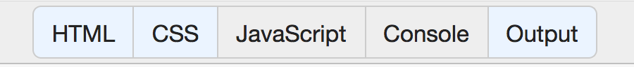

# Step 1

If necessary, scaffold out the html. This should be done automatically by jsbin

* Tell students to navigate to [jsbin.com](jsbin.com)

* Ensure that they have only the `HTML`, `CSS`, and `Output` tabs are selected



* Explain briefly that jsbin allows us to write our code and see the output all in one place

---
Now Walk quickly through the pre-written html

```html
<!DOCTYPE html>
<html>
<head>
  <meta charset="utf-8">
  <meta name="viewport" content="width=device-width">
  <title>JS Bin</title>
</head>
<body>

</body>
</html>
```

* Tell the students that HTML is a markup language that allows us to determine **what** appears on our webpage.

* In HTML, we have opening tags like `<body>` and closing tags like `</body>`. Point out the `/` in the closing tag. With very few exceptions, every tag needs an opening and closing tag.

* Tell students not too worry too much about the pre-written html. For now all they need to know is that every HTML file starts like this and that we add everything that we want to appear on the page between the opening and closing `body` tags.
